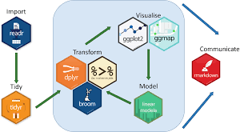

```{r setup, include=FALSE}
knitr::opts_chunk$set(echo = FALSE)
```

# Introduction

Welcome to the team’s website on works done for ISSS608 Group Project: Challenge 3: Economic considers the financial health of the city. Over time, are businesses growing or shrinking? How are people changing jobs? Are standards of living improving or declining over time? Considering the financial status of Engagement’s businesses and residents, this site addresses these questions using visual analytic techniques

# Motivation

In general, we have Several commercial software packages in market to draw data and their summaries. However,ideally, such tools should be open source, freely available and allow contributions or modifications by users. Inspired by Prof Kam, with the acquired coding skills and understanding of data ,this group project aims to create such flexible website by making use of interactive visualizations to answer questions from VAST Challenge 2022 Challenge 3 to find out the Economic status of the City of Engagement, Ohio USA.

# Methodology

To develop the dashboard, we carried out the following steps:
1. Data wrangling and transformation: The scripted dataset are tidied into formats that can be read by the R packages used e.g. using daily prices, converting the data into tibble format that is ideal for time series analysis.
2. Exploratory and Seasonal analysis: Using suitable graphical and time series decomposition methods to reveal the seasonal patterns
3. Interactive dashboard: Develop and publish an interactive dashboard containing the above
components

<center>

 
 
 </center>


# Results

The chart reveals that among the expense category, residents spend much for shelter.The above chart reveals that among the expense category, residents spend much for shelter.The chart reveals that among the expense category, residents spend much for shelter.The chart reveals that among the expense category, residents spend much for shelter.

<center>


</center>

Plots I & II shows the individual distribution of Wage and Shelter. The histograms clearly reveal that distributions of both wage and shelter are different. Wage distribution is not normal. It’s right skewed and the majority of value lies below 100K.On the other hand shelter graph distribution is comparatively normal and predominant values lie between 5K and 15K. And the plot III reveals interesting info that residents fall under both the extreme ends as people who gets wage less than 100K als spend till 20K for shelter and there are people who gets extremely high pay (> 200K) but still chose to spend below 10K for shelter.

<center>


</center>

As we can see that, we see a wider spread in expenses as kids may want to try out the recreational activities during the winter break (Dec 22 and Jan 22) and hence a rise in recreational amount expenditure.As we can see that, we see a wider spread in expenses as kids may want to try out the recreational activities during the winter break (Dec 22 and Jan 22) and hence a rise in recreational amount expenditure.

<center>

 

</center>

Both the graphs are different from each other in terms of distribution as income curve is right skewed whereas cost of living graph is left skewed which means mean is greater than median in the former curve and vice versa in the latter curve.Both the graphs are different from each other in terms of distribution as income curve is right skewed whereas cost of living graph is left skewed which means mean is greater than median in the former curve and vice versa in the latter curve.

<center>


</center>

Line chart is usually used to showcase the trend over the duration usually for timeline. As the objective of this chart is to visualize the outline of happiness index of residents with respect to Education Level and Age Category , box plot will serve the purpose.Line chart is usually used to showcase the trend over the duration usually for timeline. As the objective of this chart is to visualize the outline of happiness index of residents with respect to Education Level and Age Category , box plot will serve the purpose.

<center>

 

</center>


# Future Work

The use of timetk and modeltime generally offer a straightforward and efficient way to generate common time series visualization. By tweaking the codes, future adaptations could be easily carried out to compare the major cryptocurrencies against other investment assets like gold, or major stock market ETFs like S&P 500. This will allow potential investors to better understand the risks and
potential returns they could derive from different investments.It is also notable that the study did not fully explore the functionalities of the R packages. For instance, Timetk has a
function to compute the cross correlation (CCF).

# Conclusion

This animation helps us to understand that first quarter of residents i.e., participants of particpants Id (0-200) gets wage in all ranges. Its spread out among both the axes. But majority of others get paid below 100K which is in line with our previous analysis. Also, the size of the circle determines cost of living. Dot sizes are greater for residents who gets paid more and who spends more for shelter (its obvious as shelter is one of the expense category of cost living)

# References
Naughton, J. (n.d.). 2017 : What scientific term or concept ought to be more widely known?
Edge.org. Retrieved from https://www.edge.org/response-detail/27150

Tan, N. L. (2022, February 15). Businesstimes.com.sg. Retrieved from
https://www.businesstimes.com.sg/government-economy/new-anti-scam-commandstronger-
public-education-to-combat-rising-scams-desmond

Wikipedia. (n.d.). Simpson's paradox. Wikipedia. Retrieved from
https://en.wikipedia.org/wiki/Simpson's_paradox
