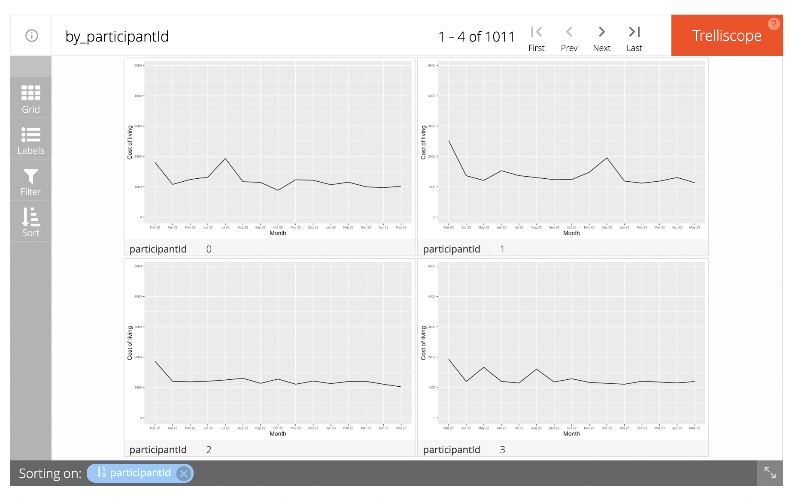
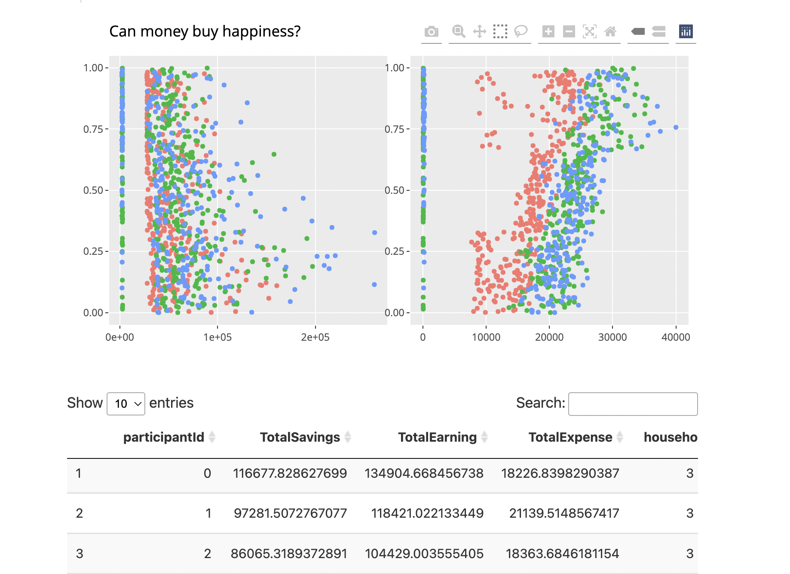
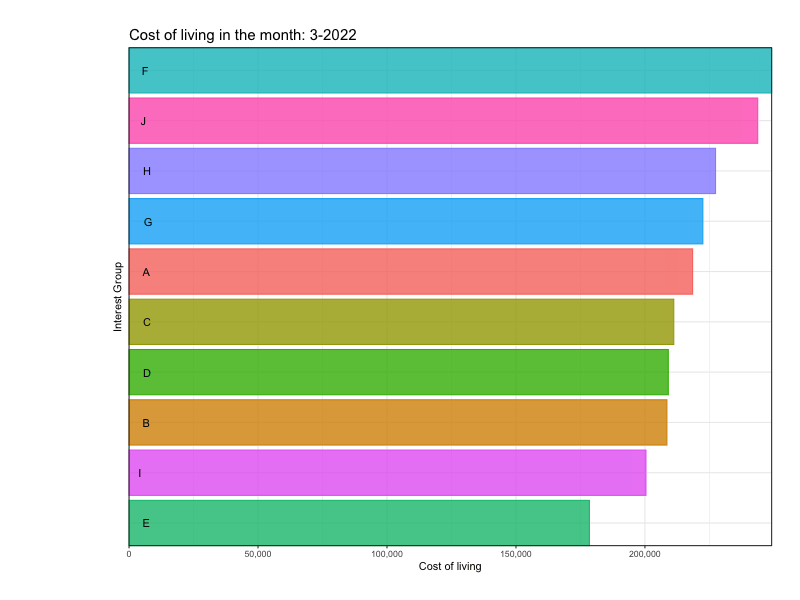
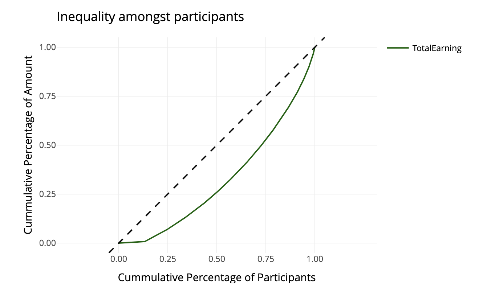
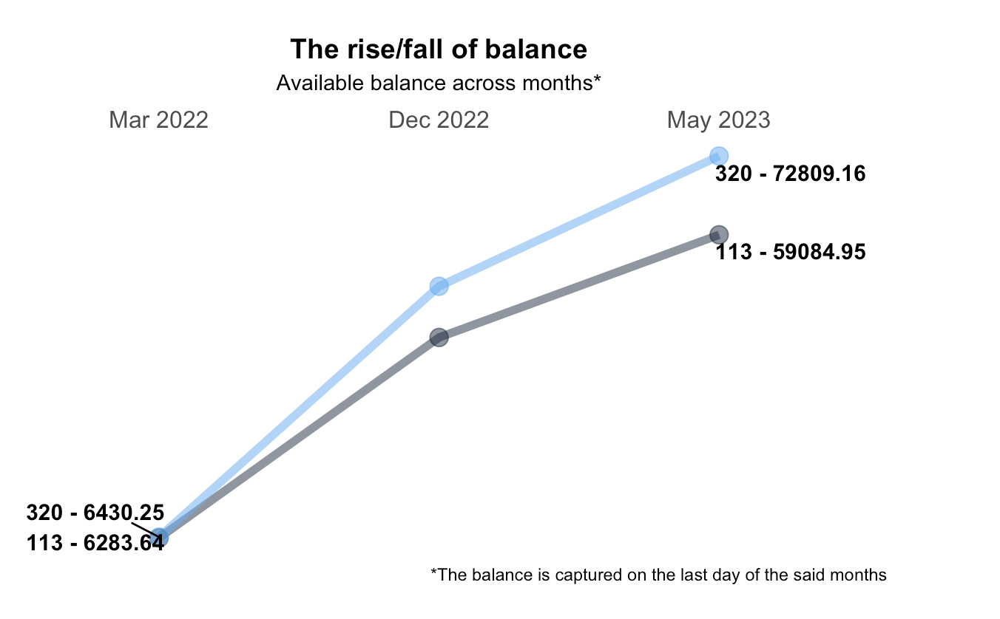
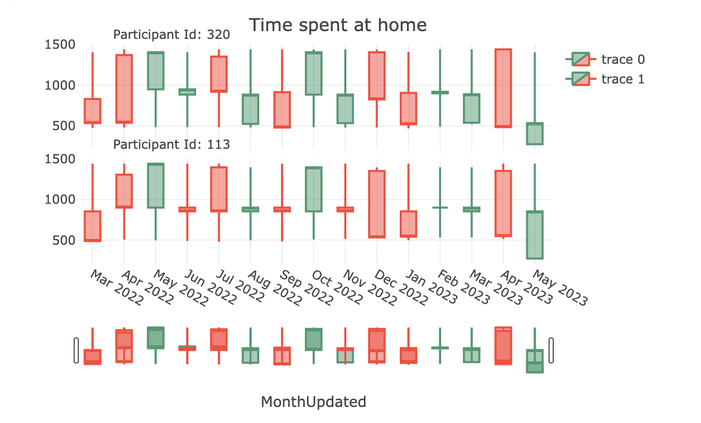

```{r setup, include=FALSE}
knitr::opts_chunk$set(message = FALSE)
```

# Motivation

In general, we have Several commercial software packages in market to draw data and their summaries. However,ideally, such tools should be open source, freely available and allow contributions or
modifications by users. Inspired by Prof Kam, with the acquired coding skills and understanding of data ,this group project aims to create such flexible website by making use of interactive visualizations to answer questions from [VAST Challenge 2022](https://vast-challenge.github.io/2022/) Challenge 3 to find out the Economic status of the City of Engagement, Ohio USA.
 

# Problem Statements 
Following are the questions we aim to answer, referencing from VAST Challenge 2022 Challenge 3 questions: 

***Challenge 3: Economic** considers the financial health of the city. Over time, are businesses growing or shrinking? How are people changing jobs? Are standards of living improving or declining over time?*

*Consider the financial status of Engagement’s businesses and residents, and use visual analytic techniques to address these questions.*

1. Over the period covered by the dataset, which businesses appear to be more prosperous? Which appear to be struggling? Describe your rationale for your answers. Limit your response to 10 images and 500 words.
2. How does the financial health of the residents change over the period covered by the dataset? How do wages compare to the overall cost of living in Engagement? Are there groups that appear to exhibit similar patterns? Describe your rationale for your answers. Limit your response to 10 images and 500 words.
3. Describe the health of the various employers within the city limits. What employment patterns do you observe? Do you notice any areas of particularly high or low turnover? Limit your response to 10 images and 500 words.

# Approach 
## Question 1
It is observed from the datasets provided by [VAST Challenge 2022](https://vast-challenge.github.io/2022/) that there are two types of businesses present in Engagement, Ohio USA, namely:

* Restaurants; 
* Pubs

They will be evaluated based on:

* Frequency and number of participants' visits;
* Revenue (participants' spending)

According to the dataset descriptions provided by VAST Challenge, all restaurants have a Prix Fixe food cost for participants to dine in and all pubs have a hourly cost to visit the pub. Therefore, assuming all visits to restaurants are for dinning, restaurants' revenue will be calculated by number of visits times Prix Fixe food cost. Similarly, pubs' revenue will be calculated by duration of visits times hourly cost of visits.  

Alternative approach of deriving balance difference before and after restaurants and pubs visits as spending is considered but not preferred as balance differences are inconsistent and could be due to unknown reasons.   

## Question 2

One question which rides in the minds of every reader who resides or does not reside in a city is - How expensive or affordable is the cost of living here? Can a resident residing here build up a good bank balance over the years?

Keeping the sample of 1000 participants in mind, this segment will help study the financial health of each of the participants.

The <i>FinancialJournal.csv</i> helps understand the expense in categories such as Food, Recreation, Shelter and Earnings such as Wage. (Assumption : All positive values corresponds to credit and negative ones are debited)

<i>Trellis Display</i> can be used to understand the cost of living of each of the participants. This will also give us an idea on the living index of the city over the months to see if the living standard increased over the months which may have motivated participants to leave the city.

The sample collected consists of diverse participants. Participants can be partitioned based on the educational qualifications, Number of Household members, Interest groups (A-H), Age groups, etc. We can use such partitions to our favour to understand the similarity between groups. 

Since we are dealing with our data in monthly format, <i>Column Graph</i> can help us understand the expenses incurred by these groups. 

<i>Ridge plot</i> can help us understand the distribution in the expenses over months during peak and off peak seasons

To understand the earning pattern of the participants, a <i>Lorenz curve</i> can help us understand if the rich gets richer. 

With the help of Interactive/Coordinated plots (Example: Scattered plot), we can also understand if people who earn more, spend more and if we see any relation with joviality. 

## Question 3

### Financial health of the employers

By merging *jobs.csv* and *employers.csv* by employerId, we can find out which employer pays more and thereby we can arrive to the conclusion of financial status of employers. 

Also by deriving Which employers have the record of most numbers of employees switching jobs, we'll understand their workspace culture and how likely the employer(company) may be referred to ?  

### Employment patterns 

We can also find out how many jobs does each Workplace provding with the help of *jobs.csv* and *employers.csv*

Also, with the help of *jobs.csv* file, let's try to find if there is any correlation between employees' pay and  their educational qualification.

### Turnover Analysis

To analyse the turnover, let us have a close look on *TravelJournal.csv*. Once the data wrangling (filtering out the purpose of Work/Home commute and grouping by participantId, travelEndLocation) is performed, we are not just finding out the overall turnover percentage rate but also with the help of apprpriate visualisation we are able to find out the exact participants who have disappeared from local job market, and who have partially employed by examining the no. of rows (n).


# Early Prototypes

#### Understanding the cost of living of Participants

Graph: Line chart in Trellis Display


Rationale: It will help us to understand the cost of living of each and every participant and given the functionality of the Trelliscope, we can add additional filters such as educational background and age group to understand the trends amongst such groups

#### Comparing and relating the earning and expenditure trends

Graph: Scatter plot for each of the components, designed in a coordinated way 



Rationale: We would be able to highlight and deep dive on unusual trends and the table will help us understand the attributes.

#### Finding out the similarity between groups

Graph: Column graph depicting the expenditure patterns.



Rationale: By creating an animated graph seperated between months, we can observe the rise/fall in the expenditure pattern between groups


#### Inequality amongst participants

Graph: Lorenz curve



Rationale: A Lorenz curve is a graphical representation of the distribution of income or wealth within a population.

#### The rise/fall of available balance

Graph: Slope Graph



Rationale: This will help us compare between participants and depict a graphical representation of the financial health over the months

#### Understanding the opening and closing monthly expense

Graph: Candle Stick



Rationale: Like the opening and closing figures of stock market, we can notice the same here with the available balance and understand the peak months when the expense has been ceiling high.
